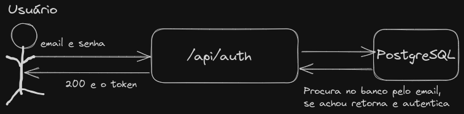
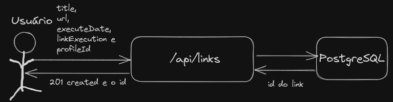

# Monitoring API

## Ferramentas utilizadas


## Projetos complementares do Monitoring
- [Monitoring Jobs](https://github.com/Kaua3045/monitoring-jobs)
- [Monitoring Consumer](https://github.com/Kaua3045/monitoring-consumer-go)

## Sobre

Eu criei um projeto para verificar a disponibilidade do seu site através de uma url fornecida, você pode escolher se quer verificar uma única vez, se você quer verificar todos os dias no mesmo horário ou então a cada mês, tendo um painel que mostra a porcentagem de tempo online, podendo filtrar as verificações por um período, você também pode ver qual foi o tempo de resposta da sua aplicação, para cada verificação e o status.

- Porquê decidiu fazer esse projeto?
  - Para aplicar o que eu estudava, aprender mais sobre deploy e aplicar tudo em um projeto grande

- Quais foram os desafios de implementá-lo?
  - Trabalhar com datas, envio de imagens para o AWS S3, fazer a parte de filtro no banco de dados para os links e a parte do deploy com CI/CD

- O que eu aprendi com ele?
  - Enviar imagens para o S3, deploy na AWS utilizando CI/CD e trabalhar com datas

## Tabela de conteúdos

- [Arquitetura](#arquitetura)
- [Features](#features)
- [Requsitos para rodar o projeto](#requisitos)
- [Instruções para executar o projeto](#instruções-para-executar-o-projeto)
- [Contribua com o projeto](#contribuindo-com-o-projeto)
- [Changelog](#changelog)

## Arquitetura


**Camadas da aplicação**

*Domain, é a camada onde se encontra as regras de negócio, validações e as interfaces gateways (abstração dos métodos do banco dedados, são usadas para remover o acomplamento com o banco de dados)*

*Application, é a camada que contem todos os casos de uso (criar um usuário, pegar um usuário pelo id, atualizar um usuário, deletar um usuário, esse é famoso CRUD) e contem a integração com o gateway do banco de dados*

*Infrastructure, é a camada responsável por conectar tudo, o usuário com a application e domain layer, contem a conexão com o banco de dados, entidades do banco e as rotas*

## Features

Principais rotas e features do sistema

1. Criação de uma conta na aplicação:


<br>

2. Logar em uma conta já cadastrada na aplicação:


<br>

3. Criar um link para ser validado:


## Requisitos para rodar o projeto

1. Docker e docker-compose
2. Java e JDK 19

## Instruções para executar o projeto

1. Baixe a aplicação e instale as dependências:
```bash
# Baixando o projeto e acessando o diretorio
git clone https://github.com/Kaua3045/monitoring-api.git cd monitoring-api

# Baixando as dependências
./gradlew --refresh-dependencies  
```

2. Antes de executar a aplicação, você precisa configurar o arquivo .env.example, depois renomeie ele para .env

3. Agora inicie o container do banco de dados:
```bash
# Execute o container do banco de dados
docker-compose -f docker-compose-dev.yml up -d
```

4. Agora inicie a aplicação:
```bash
# Iniciando a aplicação
./gradlew bootRun
```
5. A url base da aplicação é: *localhost:8080/api*

## Contribuindo com o projeto

Para contribuir com o projeto, veja mais informações em [CONTRIBUTING](doc/CONTRIBUTING.md)

## Changelog

Para ver as últimas alterações do projeto, acesse [AQUI](doc/changelog.md)

## Configurações para dev
After cloning project add commit-msg hook in your git path
```shell
    git config core.hooksPath .githooks
```
